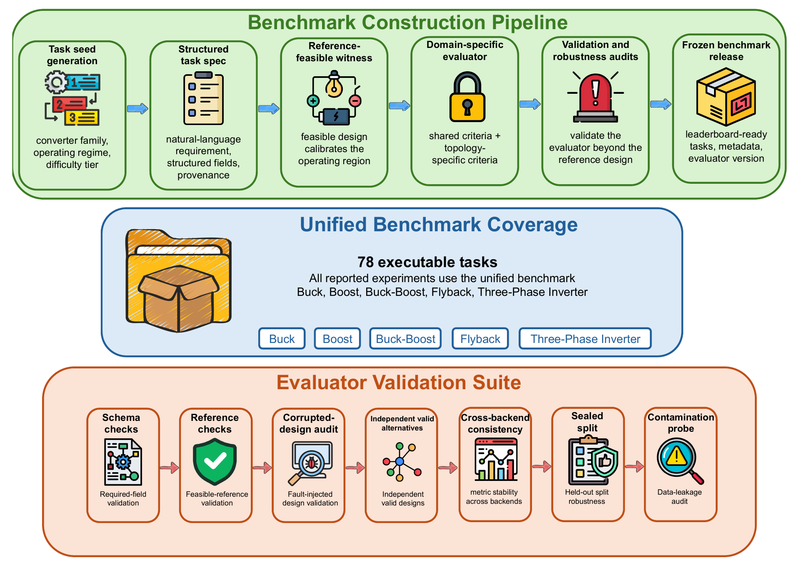
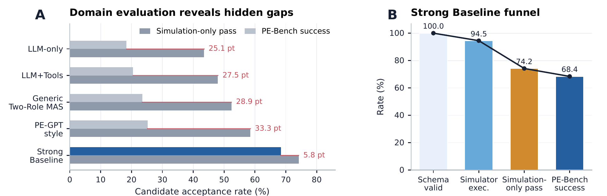

<div align="center">

# PE-Bench

### A Benchmark for Evaluating Agent-Based Power Electronics Design Systems

**Evaluate design agents through traceable engineering evidence.**

[](https://neurips.cc/Conferences/2026/CallForEvaluationsDatasets)
[](#benchmark)
[](LICENSE)

[Overview](#overview) · [Quick start](#quick-start) · [Benchmark](#benchmark) · [Paper results](#paper-results) · [Reference](#reference)

**78 tasks &nbsp; / &nbsp; 5 converter families &nbsp; / &nbsp; 8 compared methods**

Manuscript under review at **NeurIPS 2026, Evaluations & Datasets Track**.

</div>

PE-Bench evaluates the consistency of AI-generated power-electronics designs: requirements, topology, equations, components, safety margins, performance evidence, and the final review decision. It provides executable tasks, feasible reference designs, component catalogs, and an evaluator that explains why a candidate passes or fails.

## Overview

[](assets/figures/overview.png)

*From structured engineering requirements to a frozen benchmark and domain-specific checks. Figure from the submitted manuscript; click to enlarge.*

## Quick start

Use **Python 3.12**. Download this repository with **Code → Download ZIP** (or clone it), extract it, and open a terminal in the project folder.

```bash
python3 -m venv .venv
source .venv/bin/activate
python -m pip install -r requirements.txt
python -m pebench check
```

On Windows, create the environment with `py -3.12 -m venv .venv` and activate it with `.venv\Scripts\Activate.ps1` in PowerShell.

The check validates all **78 tasks**, evaluates their reference designs, and checks the release data and frozen manuscript tables. It uses deterministic formula/stub checks and needs **no API key or PLECS** after installation.

Run the full reference suite and save candidate/result records:

```bash
python -m pebench run
```

One entry point covers the usual workflow:

| Command | What it does |
| --- | --- |
| `python -m pebench check` | Check the task banks, reference designs, metadata, and included records |
| `python -m pebench run` | Run the 78-task reference suite locally |
| `python -m pebench evaluate --help` | Evaluate your own candidate JSON against a task |
| `python -m pebench tables` | Check and rebuild tables from the included manuscript summary records |
| `python -m pebench export` | Create a clean anonymous artifact ZIP |

Use `python -m pebench --help` for options. Local run output is saved under the ignored `results/` directory. Reference runs check task feasibility; they are not LLM leaderboard results.

## Benchmark

| Converter family | Tasks | Task files |
| --- | ---: | --- |
| Buck | 12 | [Topology tasks](pebench/tasks/topology_full) |
| Boost | 12 | [Topology tasks](pebench/tasks/topology_full) |
| Buck-Boost | 12 | [Topology tasks](pebench/tasks/topology_full) |
| Flyback | 30 | [Flyback tasks](pebench/tasks/flyback) |
| Three-phase inverter | 12 | [Inverter tasks](pebench/tasks/inverter) |

The manuscript groups these into 60 development tasks, 6 held-out tasks, and 12 inverter extension tasks. All 78 task cards are included in this artifact. Difficulty ranges from **easy** to **stress**, including tight margins, conflicting objectives, and cases that require escalation.

**Verifiable Task Success Rate (VTSR)** is the fraction of task–seed evaluations that satisfy all required engineering checks. An evidence-supported review or escalation decision can also count as success. A feasible reference design anchors each task; alternative valid designs do not have to match it exactly.

The evaluator returns structured scores, constraint violations, failure tags, reported metrics, and an execution log. Start with the [candidate schema](artifacts/schema/candidate.schema.json) and [result schema](artifacts/schema/result.schema.json) to connect your own system.

## Paper results

The submitted manuscript compares eight methods on **78 tasks × 3 seeds**. Values are mean ± standard deviation across three seeds. These are reported manuscript results, summarized in the included [frozen records](artifacts/evidence/frozen_v1/leaderboard_summary.csv).

| Method | VTSR ↑ |
| --- | ---: |
| LLM-only | 18.4 ± 1.5% |
| Structured-output only | 19.0 ± 1.2% |
| Text Self-Refine | 17.5 ± 2.0% |
| LLM+Tools | 20.5 ± 1.8% |
| Single-Agent+Retry | 21.8 ± 2.2% |
| Generic Two-Role MAS | 23.5 ± 1.9% |
| PE-GPT-style | 25.2 ± 2.5% |
| Strong Baseline | **68.4 ± 2.8%** |

[](assets/figures/verification-gap.png)

*Simulation success is only part of the evidence. Domain-specific checks expose unsupported claims, component problems, and incomplete design decisions. The Strong Baseline is a comparison system, separate from the PE-Bench evaluator.*

### Evidence and reproducibility

| Included evidence | What it supports |
| --- | --- |
| [Task dataset](artifacts/dataset/task_records.jsonl), catalogs, and evaluator | Local checks of released tasks and candidate designs |
| [Frozen manuscript records](artifacts/evidence/frozen_v1) | Rebuilding the manuscript tables from summary records |
| [Independent rerun index](artifacts/evidence/evidence_run_index.csv) | Inspecting separate API reruns and their recorded outcomes |

The frozen records are **summary-level evidence, not raw API logs**. The included independent reruns did not pass the manuscript-alignment gates and do not replace the paper's numbers. `tables` rebuilds the recorded tables; it does not rerun the LLM experiments. The default local path uses formula/stub checks, while live PLECS execution requires a separately configured installation and bridge.

## Reference

```text
pebench/                  Evaluator, tasks, baselines, and command implementation
assets/                   Component catalogs, task template, and two paper figures
artifacts/                Dataset, schemas, release metadata, and experiment evidence
tests/                    Automated checks
README.md                 Project overview and usage reference
croissant_metadata.json   Machine-readable dataset and Responsible AI metadata
```

<details>
<summary><strong>Check a single candidate</strong></summary>

Create a reference candidate, then evaluate it. Replace `results/candidate.json` with your own schema-compatible design to test your system.

```bash
python -m pebench run --task pebench/tasks/flyback/easy_acdc_5v1a.yaml
python -m pebench evaluate \
  --task pebench/tasks/flyback/easy_acdc_5v1a.yaml \
  --candidate results/candidate.json
```

The candidate is saved to `results/candidate.json`; its evaluation is saved to `results/evaluation.json`.

</details>

<details>
<summary><strong>Evaluation protocol</strong></summary>

### Evaluation protocol

Tasks contain a natural-language specification, structured requirements, difficulty, provenance, evaluation criteria, a feasible reference design, and known failure modes. Family-specific fields describe topology and closure gates.

The evaluator checks schema completeness, requirement grounding, topology feasibility, equations, component ratings and derating, performance/claim consistency, protection, and review or escalation behavior. Results include `pass_fail`, `score_total`, `sub_scores`, `constraint_violations`, `simulation_metrics`, `failure_tags`, `failure_groups`, `aggregate_scores`, `execution_log`, and `runtime_stats`.

For comparable runs, record the frozen task inventory, evaluator version, model/provider, prompts, seeds, simulator mode, fallback behavior, candidate/result files, and checksums. Report VTSR alongside unsupported-value rates, invalid-component rates, simulator calls, and retry budgets. Feasibility checks, partial runs, and tuning sweeps should be identified separately from full benchmark comparisons.

</details>

<details>
<summary><strong>Dataset and responsible use</strong></summary>

### Dataset and responsible use

The dataset consists of synthetic, author-curated engineering requirements, bounded component catalogs, and feasible design references. It contains no personal data. Download the normalized [JSONL](artifacts/dataset/task_records.jsonl) or [CSV](artifacts/dataset/task_records.csv), and inspect [Croissant metadata](croissant_metadata.json) for the machine-readable description and Responsible AI fields.

PE-Bench is intended for comparing and debugging systems that generate auditable converter designs. Coverage is limited to the released task families, catalog entries, operating regions, and evaluator assumptions. Formula/stub checks are an abstraction; model outputs and external simulator behavior may vary.

A passing result means the candidate satisfies the benchmark's checks. Hardware validation, thermal and layout review, EMI/EMC, regulatory certification, procurement, and production sign-off require separate evidence and qualified engineering review.

**License:** code is MIT licensed. Task cards, inventories, documentation, and schema artifacts are CC BY 4.0 unless a third-party notice specifies otherwise. Full terms are in [LICENSE](LICENSE).

</details>

<details>
<summary><strong>Advanced runs and anonymous export</strong></summary>

### Advanced runs and anonymous export

To test an LLM baseline, copy [.env.example](.env.example) to the ignored `.env` file and configure your own OpenAI-compatible provider. Select an available model with `run --baseline direct_prompting --model MODEL_ID`. `run --help` lists seed and simulator options. Model-backed runs require your provider account.

Live PLECS execution is optional and requires your own installation and bridge. `PEBENCH_PLECS_XMLRPC_HOST` and `PEBENCH_PLECS_XMLRPC_PORT` set XML-RPC reachability; `REFERENCE_AGENT_PLECS_MCP_COMMAND` and `REFERENCE_AGENT_PLECS_MCP_ARGS` configure the bridge. Reachability alone does not establish live simulation evidence. Inspect readiness with `python -m pebench._commands.doctor_plecs_backend`; use `--simulator-mode stub` for the self-contained local path.

The internal command modules under `pebench/_commands/` retain the experiment queue, evidence-freezing, and alignment tools. Promotion to manuscript evidence is gated by comparison with the frozen records; completion alone is insufficient. Read each rerun's `manifest.json`, `promotion_decision.json`, and `paper_alignment_report.json` before attributing claims to it.

`python -m pebench export` produces an anonymous ZIP under `dist/`, excluding local credentials, run outputs, caches, external system roots, and paper sources. The exported artifact includes the README and its two figures. To inspect the test suite, run `python -m pytest`.

</details>

<details>
<summary><strong>Citation</strong></summary>

```bibtex
@misc{pebench2026,
  title = {PE-Bench: A Benchmark for Evaluating Agent-Based Power Electronics Design Systems},
  author = {Anonymous Authors},
  year = {2026},
  note = {Under review at NeurIPS 2026, Evaluations and Datasets Track}
}
```

</details>
